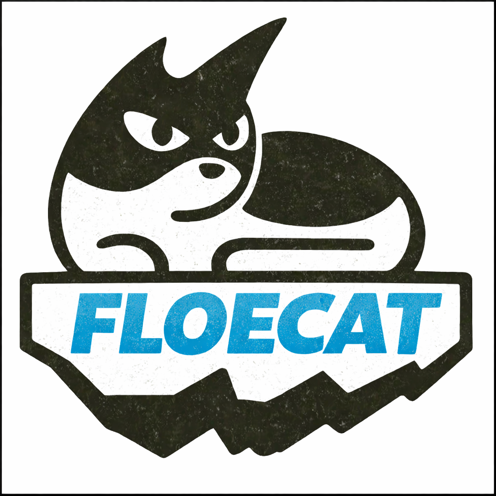

<p align="center">
  
</p>

Floecat is a catalog-of-catalogs for modern data lakehouses. It federates metadata harvested from
Delta Lake and Iceberg sources, stores a canonical view in append-only blob storage, and exposes the
resulting hierarchy over gRPC for discovery, authorization, and query planning.

The repository is purposely modular. Each top-level directory corresponds to an operational
component (service runtime, connector packages, storage backends, CLI, etc.). Detailed,
component-specific documentation lives under [`docs/`](docs).

## Quick Start (Docker + LocalStack)

Baseline requirements for quickstart: Docker Engine + Docker Compose v2.

Run Floecat using published GHCR images (currently `:main`) and a LocalStack backend:

```bash
FLOECAT_SERVICE_IMAGE=ghcr.io/eng-floe/floecat-service:main \
FLOECAT_ICEBERG_REST_IMAGE=ghcr.io/eng-floe/floecat-iceberg-rest:main \
FLOECAT_CLI_IMAGE=ghcr.io/eng-floe/floecat-cli:main \
FLOECAT_PULL_POLICY=always \
FLOECAT_ENV_FILE=./env.localstack \
COMPOSE_PROFILES=localstack \
docker compose -f docker/docker-compose.yml up -d
```

This starts:

- `ghcr.io/eng-floe/floecat-service:main`
- `ghcr.io/eng-floe/floecat-iceberg-rest:main`
- `ghcr.io/eng-floe/floecat-cli:main`
- LocalStack (`COMPOSE_PROFILES=localstack`)

Stop the stack:

```bash
FLOECAT_SERVICE_IMAGE=ghcr.io/eng-floe/floecat-service:main \
FLOECAT_ICEBERG_REST_IMAGE=ghcr.io/eng-floe/floecat-iceberg-rest:main \
FLOECAT_CLI_IMAGE=ghcr.io/eng-floe/floecat-cli:main \
FLOECAT_PULL_POLICY=always \
FLOECAT_ENV_FILE=./env.localstack \
COMPOSE_PROFILES=localstack \
docker compose -f docker/docker-compose.yml down --remove-orphans
```

Use the CLI after the stack is up:

```bash
# attach to the running cli container
FLOECAT_SERVICE_IMAGE=ghcr.io/eng-floe/floecat-service:main \
FLOECAT_ICEBERG_REST_IMAGE=ghcr.io/eng-floe/floecat-iceberg-rest:main \
FLOECAT_CLI_IMAGE=ghcr.io/eng-floe/floecat-cli:main \
FLOECAT_PULL_POLICY=always \
FLOECAT_ENV_FILE=./env.localstack \
COMPOSE_PROFILES=localstack \
docker compose -f docker/docker-compose.yml attach cli

# or start a fresh one-off CLI session
FLOECAT_SERVICE_IMAGE=ghcr.io/eng-floe/floecat-service:main \
FLOECAT_ICEBERG_REST_IMAGE=ghcr.io/eng-floe/floecat-iceberg-rest:main \
FLOECAT_CLI_IMAGE=ghcr.io/eng-floe/floecat-cli:main \
FLOECAT_PULL_POLICY=always \
FLOECAT_ENV_FILE=./env.localstack \
COMPOSE_PROFILES=localstack \
docker compose -f docker/docker-compose.yml run --rm --use-aliases cli
```

In the CLI, set the demo account `t-0001` before issuing catalog queries:

```text
floecat> account t-0001
account set: 5eaa9cd5-7d08-3750-9457-cfe800b0b9d2
floecat> catalogs
CATALOG_ID                                CREATED_AT                DISPLAY_NAME              DESCRIPTION
ab5bcc89-fcad-3574-935f-b5249eacf700      2026-02-25T13:29:00.947Z  examples                  Examples catalog
floecat>
```

Detach without stopping the CLI container:

```text
Ctrl+P, Ctrl+Q
```

Optional Make shortcuts:

```bash
make quickstart-up
make quickstart-down

# override owner/tag
make quickstart-up QUICKSTART_OWNER=<owner> QUICKSTART_TAG=<tag>
```

## Build, Test, and Run

Contributor requirements: Java 25+, Maven, Make.

```bash
make build
make test
make run
```

Seed data is enabled by default (`floecat.seed.enabled=true`); the service starts with a demo account,
catalogs, namespaces, tables, and snapshots.

## Documentation

- Architecture, system flow, and modules: [`docs/architecture.md`](docs/architecture.md)
- Storage model and key layout: [`docs/storage-layout.md`](docs/storage-layout.md)
- API access patterns: [`docs/api-access.md`](docs/api-access.md)
- External authentication and session headers: [`docs/external-authentication.md`](docs/external-authentication.md)
- CLI commands: [`docs/cli-reference.md`](docs/cli-reference.md)
- Operations, testing, and observability: [`docs/operations.md`](docs/operations.md)
- Docker compose modes and overrides: [`docs/docker.md`](docs/docker.md)

All additional component docs live under [`docs/`](docs).

## Contributing

Contribution workflow, review policy, and contributor expectations are documented in:

- [`CONTRIBUTING.md`](CONTRIBUTING.md)

All participants are expected to follow:

- [`CODE_OF_CONDUCT.md`](CODE_OF_CONDUCT.md)
- [`SECURITY.md`](SECURITY.md) for vulnerability reporting
